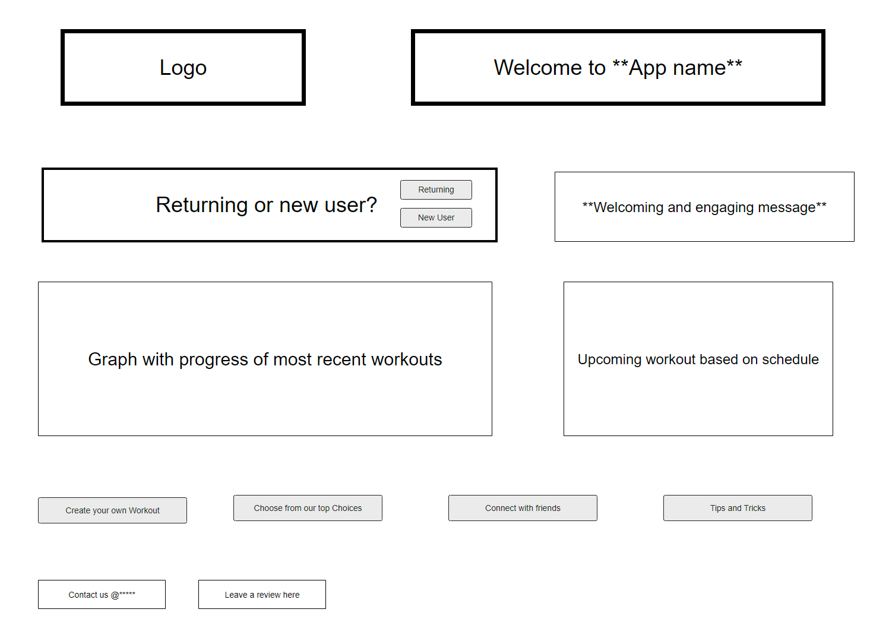

# Web Dev Starter Code

## Project Spec

### General Theme

The theme of this project is a workout tracker website that is primarily designed for weightlifting enthusiats. This website aims to help users track their workout progress by allowing them to log the weight, repetitions, and exercises they perform. It also offers social features like connecting with friends, sharing progress, and viewing each other's workout histroy.

### What Is It Going To Do?

This website will provide a platform for users to create and manage their own weightlifting workouts. Their will be features such as having the ability to create their own workouts and organize them in whatever manner they see fit. A "Chest Day" workout will have specific exercises including the sets, reps, and weights for each. It will also allow users to track the weights and reps they perform for each exercise to ensure progress is being made. Users can also visualize the progress by viewing graphs that will show the change and progress done for each workout. We take things up a notch by allowing users to connect with friends and be able to view each others' progress as well (of course it is all dependent on whether you choose to). Users can also choose from a database of workouts with instructions and tips. Finally, users can also have the option to allow notifications for reminders of what they will be focusing on that day.

### Who Is The Target Audience?

The target audience of the website will encompass primarily weightlifting enthusiasts. Those who really want to track their progress and be able to visualize it. It will also benefit beginners with the extensive knowledge provided from other databases. Personal trainers also can utilize this website by creating workouts for their clients and viewing their progress. 

### What Sort Of Data Will It Manage?

The website will need to store user data such as accounts, emails, passwords, and other information. This is important for remembering returning users. It will also need to store workout data such as custom plans created by users. Exercise data from databases will also need to be accounted for. The progress being done by users for each workout will also need to be stored while also ensuring friend relationships are maintained. Finally, notifications and friend acitivites will need to be monitored as well.

### Stretch Goals

Once the website is up and running, I hope to create challenges or leaderboards for users to participate in. Being able to integrate videos for common exercises would also be another option I am considering. To expand on the fitness aspect I also think creating a diet tracker would benefit users greatly and help friends keep each other accountable. With so many "gym influencers" creating videos of themselves working out, I think it would be a great idea to somehow connect the application to other social media sites and integrate it with them. I also think expanding from just weightlifting towards other fields of fitness would also be a great addition. Creating a mobile application from it would also be crucial for accessibility. Finally, being able to create workouts for users based on their previous workouts using machine learning would be a fantastic idea as well.

## Project Wireframe

